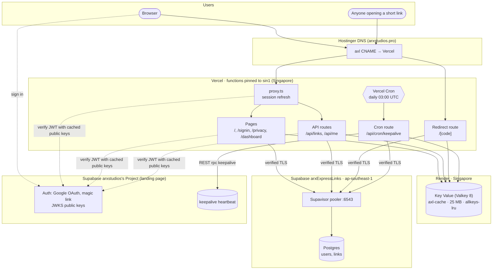
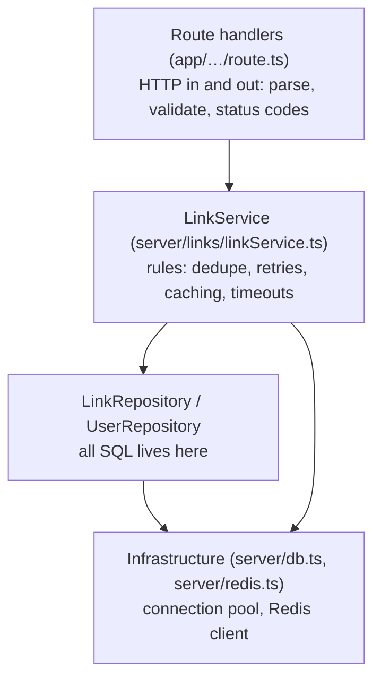

# 2. Architecture

## Components

### Where each piece runs, and why

| Component | Where | Why there |
|---|---|---|
| Next.js app | Vercel, **`sin1`** (pinned in `vercel.json`) | Next's native host; serverless with no sleeping (unlike Render's free web services). Singapore sits next to Redis and Postgres. |
| Redis (Valkey) | Render Key Value, **Singapore** | Free, never sleeps. Render has no Tokyo region, which is why everything moved to Singapore. |
| Postgres | Supabase **arxExpressLinks**, **Singapore** | Free, doesn't expire (Render's free Postgres is deleted after 30 days). Recreated in Singapore to sit next to Redis. |
| Sign-in | Supabase **arxstudios's Project** | The landing page already runs Google sign-in there; axl reuses the same accounts. |
| DNS | Hostinger | Where `arxstudios.pro` already lives; one CNAME record. |

Every hop on the redirect path (Vercel → Redis → Postgres) stays inside Singapore.
The auth project is only contacted to download its public keys, not on every request.

## One app, three kinds of traffic

The whole product is a single Next.js app. Its routes fall into three groups with
different needs:

| Traffic | Routes | Needs | Session check? |
|---|---|---|---|
| **Redirects** | `/[code]` | As fast as possible, public | **No**, skipped entirely |
| **App & API** | `/dashboard`, `/api/links…`, `/api/me` | Signed-in user | Yes |
| **Marketing** | `/`, `/signin`, `/privacy` | Fast first paint, pretty | Yes (to redirect signed-in users to the dashboard) |

`proxy.ts` (Next 16's name for middleware) refreshes the Supabase session cookie. Its
matcher lists only `/`, `/dashboard`, `/api/*`, `/auth/*` and `/signin`, so **short-link
redirects never pay for a session check**.

Next.js matches exact paths before dynamic ones, so `/dashboard` always wins over
`/[code]`. Codes that would collide with the app's own paths (`api`, `dashboard`,
`signin`, …) are reserved and can't be used as aliases (`lib/codes.ts`).

## Code layering

The server code is split into layers. Each layer only talks to the one below it:

| Layer | Knows about | Doesn't know about |
|---|---|---|
| Routes | HTTP, zod validation, auth, JSON shape (`linkJson.ts`) | SQL, Redis keys |
| Service | Business rules, cache keys and TTLs | HTTP, SQL text |
| Repositories | SQL, row ↔ object mapping | Rules, caching, HTTP |

This split is what let the project move from Fastify to Next.js with the repository and
service copied over unchanged. Only the route layer was rewritten.

### Key modules

| Module | Responsibility |
|---|---|
| `server/env.ts` | Validates environment variables with zod, **lazily** (on first use, not at import), so `next build` works without runtime secrets |
| `server/db.ts` | One `pg.Pool` per instance (max 5), stored on `globalThis`; `attachDatabasePool` closes idle connections before Vercel suspends an instance |
| `lib/pgConnection.ts` | Builds the connection config; with a CA certificate, enables verified TLS and strips SSL parameters from the URL that would override it |
| `server/redis.ts` | One ioredis client per instance; **no command timeout** (see [System design](03-system-design.md#redis-connection-and-timeouts)) |
| `lib/timeout.ts` | `withTimeout()`: bounds how long a caller waits without cancelling the work |
| `server/auth.ts` | `getUser()`: verifies the session JWT with `getClaims()`; `unauthorized()` |
| `server/rateLimit.ts` | Fixed-window limiter in Redis; fails open |
| `server/links/linkService.ts` | Create (dedupe, collision retry), resolve (cache-aside), list, get, delete, record click |
| `server/links/clickFlush.ts` | Moves click counters from Redis to Postgres; lock-based variant for redirects |
| `server/linkNotFoundPage.ts` | Self-contained HTML for unknown links, served without rendering React |

### Connections in a serverless world

Vercel runs the app as functions. With Fluid compute, one instance serves many requests
and is reused between them. Each instance holds:

- **one Postgres pool** (up to 5 connections) through Supabase's **transaction pooler**
  (port 6543), which is built for many short-lived clients;
- **one Redis connection**, opened on first use.

Both are created lazily and kept on `globalThis`, so warm requests reuse them and Next's
dev-mode hot reload doesn't leak new pools.

## Environment variables

| Variable | Used by | Notes |
|---|---|---|
| `BASE_URL` | server | `https://axl.arxstudios.pro`; builds short URLs, and blocks links pointing back to axl |
| `DATABASE_URL` | server | Supabase transaction pooler URL (port 6543) |
| `DATABASE_CA_CERT` | server | Supabase root CA (PEM); turns on verified TLS |
| `REDIS_URL` | server | Render external URL, `rediss://` (TLS) |
| `NEXT_PUBLIC_SUPABASE_URL` | browser + server | Auth project URL (public) |
| `NEXT_PUBLIC_SUPABASE_PUBLISHABLE_KEY` | browser + server | Auth project publishable key (public by design) |
| `CRON_SECRET` | server | Shared secret Vercel Cron sends as a Bearer token |
| `CREATE_LINKS_PER_MINUTE` | server | Optional, default 10 |

In Vercel, all of these are set for **Production only**, so preview deployments can't
reach the production database.
