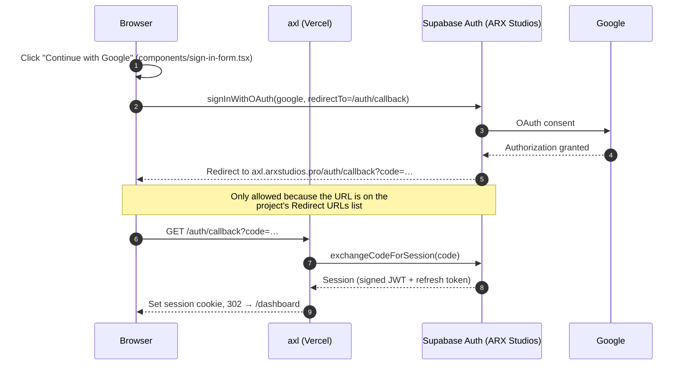
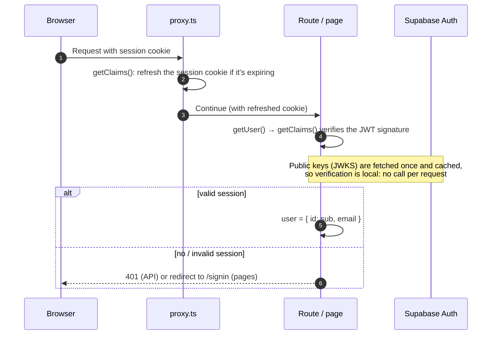
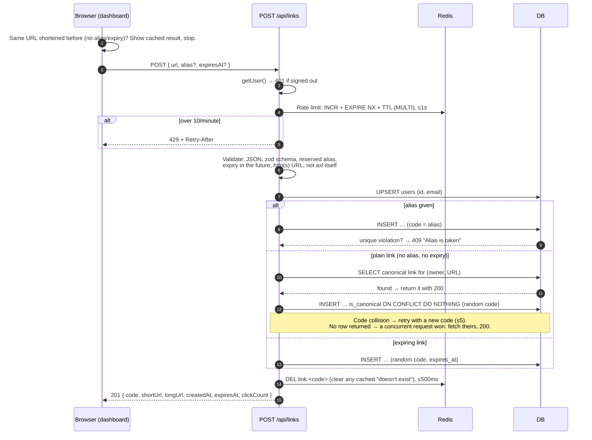
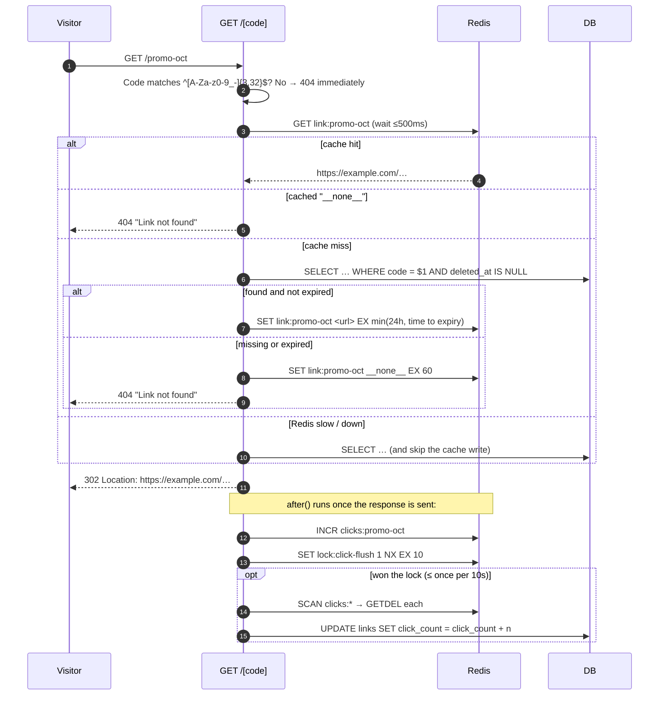
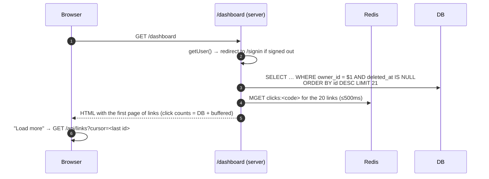
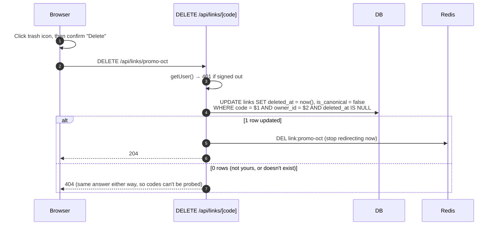
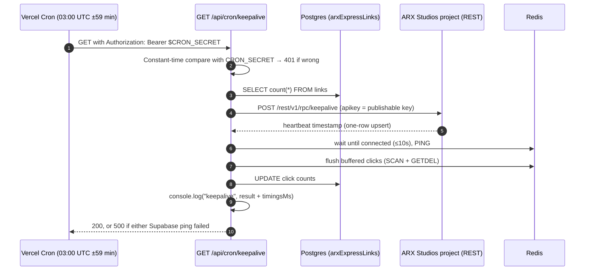

# 4. Request flows

Each flow below follows one request through the system. Participants:

- **Browser**: the user's browser or anyone opening a link
- **Proxy**: `proxy.ts`, the session refresher
- **App**: the Next.js route handler or page on Vercel (Singapore)
- **Redis**: Render Key Value
- **DB**: Postgres in Supabase arxExpressLinks
- **Auth**: Supabase Auth in the ARX Studios project

## 1. Signing in with Google

**Email magic link** works the same way: `signInWithOtp` emails a link, and clicking it
lands on `/auth/callback?token_hash=…&type=…`, which calls `verifyOtp` instead.

## 2. Any signed-in request: verifying the user

Short-link redirects (`/<code>`) are **not** in the proxy's matcher, so they skip all of
this.

## 3. Creating a link

## 4. Following a short link (the hot path)

The 404 is an HTML page for browsers (`Accept: text/html`) and `{"error":"Not found"}` for
scripts. Both are real `404` responses.

## 5. Loading the dashboard

## 6. Deleting a link

## 7. The daily keep-alive

