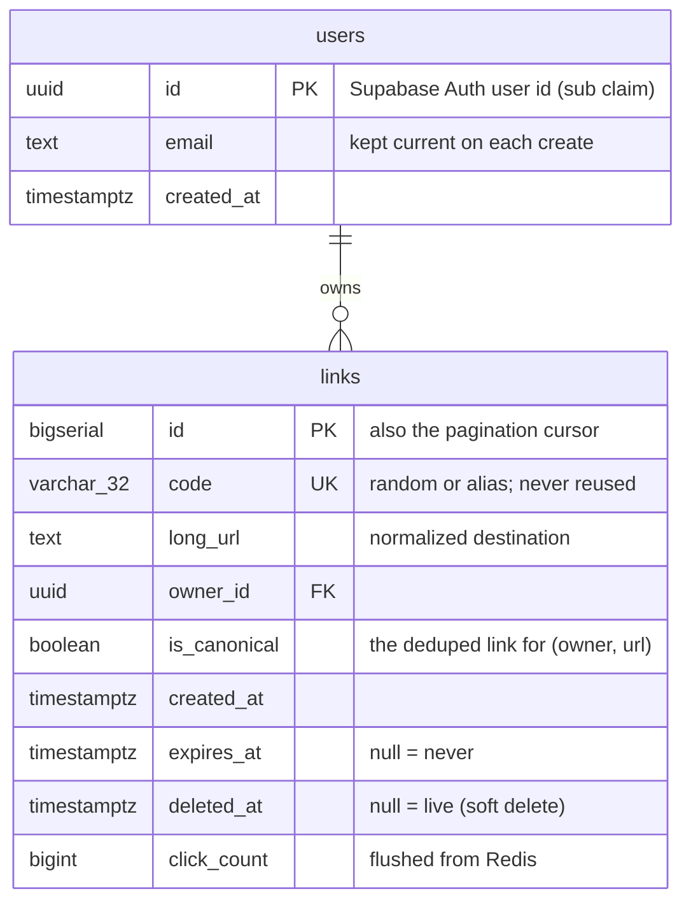

# 5. Data model

## Postgres (Supabase arxExpressLinks)

The whole schema is one migration: [`migrations/001_init.sql`](../migrations/001_init.sql).



### `users`

| Column | Type | Notes |
|---|---|---|
| `id` | `UUID` PK | The user's id in the ARX Studios auth project (the JWT `sub`) |
| `email` | `TEXT` | Updated if it changes (`ON CONFLICT … WHERE email IS DISTINCT FROM …`) |
| `created_at` | `TIMESTAMPTZ` | First time the user created a link |

It's a local copy, not a foreign key to `auth.users`, because auth lives in a
**different** Supabase project. A row is upserted on every create.

### `links`

| Column | Type | Notes |
|---|---|---|
| `id` | `BIGSERIAL` PK | Returned as a string by `pg` (BIGINT exceeds JS's safe integers) |
| `code` | `VARCHAR(32) NOT NULL UNIQUE` | The unique index is what makes collisions and taken aliases detectable |
| `long_url` | `TEXT NOT NULL` | Max 2,048 characters (validated in the API) |
| `owner_id` | `UUID NOT NULL` → `users.id` | Every link has an owner (sign-in is required) |
| `is_canonical` | `BOOLEAN NOT NULL DEFAULT false` | True for plain links (no alias, no expiry); cleared on delete |
| `created_at` | `TIMESTAMPTZ NOT NULL DEFAULT now()` | |
| `expires_at` | `TIMESTAMPTZ` | Null means the link never expires |
| `deleted_at` | `TIMESTAMPTZ` | Set on delete; the row and code stay forever |
| `click_count` | `BIGINT NOT NULL DEFAULT 0` | Incremented in batches by the click flush |

### Indexes

| Index | Definition | Serves |
|---|---|---|
| `links_pkey` | `(id)` | Primary key |
| `links_code_key` | `UNIQUE (code)` | Redirect lookups; collision and alias detection |
| `links_canonical_idx` | `UNIQUE (owner_id, sha256(long_url::bytea)) WHERE is_canonical` | Race-free dedupe; "do I already have a link for this URL?" |
| `links_owner_idx` | `(owner_id, id DESC) WHERE deleted_at IS NULL` | Dashboard listing and keyset pagination |
| `users_pkey` | `(id)` | Primary key |

Queries that must use a partial index repeat its `WHERE` condition exactly (for example
`WHERE is_canonical AND owner_id = $1 AND sha256(long_url::bytea) = sha256($2::text::bytea)`).

### Row Level Security

Supabase automatically exposes every table in the `public` schema through its REST API,
and that API is reachable with the **publishable key, which is public by design**.
Without protection, anyone could read or delete every link.

```sql
ALTER TABLE users ENABLE ROW LEVEL SECURITY;
ALTER TABLE links ENABLE ROW LEVEL SECURITY;
-- schema_migrations too (done by scripts/migrate.mts)
```

RLS is **on with no policies**, which denies the public API everything. The app connects
as the table owner, which RLS doesn't apply to, so it works normally. This was verified
in production after the migration: all three tables have RLS on and 0 policies.

### Migrations

`scripts/migrate.mts` is a small runner:
- keeps a `schema_migrations` table of applied files;
- applies each `migrations/*.sql` file in name order, once, **inside a transaction**
  together with its bookkeeping row, so a half-applied migration can't exist;
- connects with verified TLS when given a CA certificate.

| Command | Target |
|---|---|
| `npm run migrate` | Local Docker database (`.env`) |
| `npm run migrate:prod` | Supabase arxExpressLinks (`.env.supabase` + `certs/…crt`) |

New schema changes go in new numbered files (`002_…sql`). Never edit an applied one.

## Redis (Render Key Value)

| Key | Value | TTL | Written by | Purpose |
|---|---|---|---|---|
| `link:<code>` | destination URL | 24h, or less if the link expires sooner | `resolve()` on a cache miss | Redirect cache |
| `link:<code>` | `__none__` | 60s | `resolve()` for unknown/expired codes | Negative cache |
| `clicks:<code>` | integer | none (deleted when flushed) | `recordClick()` after each redirect | Click buffer |
| `ratelimit:create:<userId>` | integer | 60s (set on the first hit) | `rateLimit()` | Per-user create limit |
| `lock:click-flush` | `1` | 10s | the redirect that wins it | Spaces out click flushes |

Everything in Redis can be lost without breaking anything: the cache refills, rate
limits reset, and at worst a few seconds of clicks are lost. That's why the free,
non-persistent tier is acceptable.

Tests use Redis **database 1** (`redis://localhost:6379/1`) and flush it, so they never
touch the dev server's database 0.

## ARX Studios project: the heartbeat

Created by hand in the landing page's Supabase project for the keep-alive job:

```sql
create table if not exists public.keepalive (
  id        smallint primary key default 1 check (id = 1),
  pinged_at timestamptz not null default now()
);
alter table public.keepalive enable row level security;

create or replace function public.keepalive()
returns timestamptz
language sql
security definer
set search_path = ''
as $$
  insert into public.keepalive (id, pinged_at) values (1, now())
  on conflict (id) do update set pinged_at = excluded.pinged_at
  returning pinged_at;
$$;

revoke execute on function public.keepalive() from public;
grant execute on function public.keepalive() to anon;
```

- The table can only ever hold one row (`check (id = 1)`).
- RLS with no policies: through the public API, reads return nothing, updates and
  deletes change 0 rows, and inserts are rejected. All of this was verified after
  creation.
- The function is `security definer`, so it can write despite RLS, but all it can do is
  bump the timestamp. `search_path = ''` stops it from being tricked into using another
  schema's objects.
