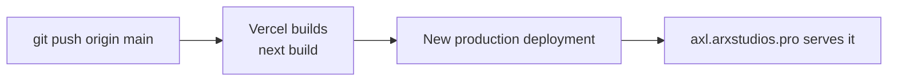

# 7. Infrastructure & deployment

This is the exact production setup, in the order it was built. Follow it to rebuild the
environment from scratch.

## Accounts and resources

| Service | Resource | Plan | Region |
|---|---|---|---|
| GitHub | `arx-studios/arx-advanced-express-links` | — | — |
| Vercel | project `arx-advanced-express-links` | Hobby (non-commercial use only) | functions `sin1` |
| Supabase | **arxExpressLinks** (data) | Free | `ap-southeast-1` (Singapore) |
| Supabase | **arxstudios's Project** (auth, shared with arxstudios.pro) | Free | — |
| Render | Key Value **axl-cache** | Free (25 MB, 50 connections) | Singapore |
| Hostinger | DNS for `arxstudios.pro` | — | — |

## Step 1: Supabase data project (arxExpressLinks)

1. Create the project in **ap-southeast-1**. Use a database password with letters and
   digits only (symbols need URL-encoding).
2. **Connect → Transaction pooler** (port **6543**): copy the URI and fill in the password.
   - The transaction pooler suits serverless: many short-lived clients.
   - The direct connection is IPv6-only on the free plan, so it isn't used.
3. **Project Settings → Database → SSL Configuration → Download certificate** →
   save it as `certs/prod-ca-2021.crt`.
4. Create `.env.supabase` (git-ignored) in the repo root:
   ```
   DATABASE_URL=postgresql://postgres.<ref>:<password>@aws-0-ap-southeast-1.pooler.supabase.com:6543/postgres
   DATABASE_CA_CERT_FILE=certs/prod-ca-2021.crt
   ```
5. Apply the schema: `npm run migrate:prod`. Expected output:
   ```
   connected to aws-0-ap-southeast-1.pooler.supabase.com:6543 (verified TLS)
   applied 001_init.sql
   ```
6. **Advisors → Security Advisor**: there should be no errors. Info-level "RLS enabled,
   no policy" notes are expected.

## Step 2: Render Key Value (axl-cache)

1. **New → Key Value**: name `axl-cache`, region **Singapore**, instance **Free**,
   maxmemory policy **`allkeys-lru`**.
2. **Networking → Inbound IP rules**: add `0.0.0.0/0` ("Vercel, dynamic IPs").
3. **Connect → External**: copy the `rediss://` URL.
4. Optionally save it locally as `.env.render` (`REDIS_URL=…`) for diagnostics.

## Step 3: Vercel

1. **Add New → Project → Import** the GitHub repo. Framework **Next.js**, defaults
   otherwise. Deploy once (the site errors until the env vars exist; that's expected).
2. **Settings → Environment Variables**, each for **Production only**:

   | Name | Value |
   |---|---|
   | `BASE_URL` | `https://axl.arxstudios.pro` |
   | `DATABASE_URL` | the transaction pooler URL from step 1 |
   | `DATABASE_CA_CERT` | the full contents of the certificate file, including the `BEGIN`/`END` lines |
   | `REDIS_URL` | the `rediss://` URL from step 2 |
   | `NEXT_PUBLIC_SUPABASE_URL` | the auth project's URL |
   | `NEXT_PUBLIC_SUPABASE_PUBLISHABLE_KEY` | the auth project's publishable key |
   | `CRON_SECRET` | a random string: `node -e "console.log(require('crypto').randomBytes(32).toString('base64url'))"` |

3. **Deployments → latest → Redeploy.** The `NEXT_PUBLIC_*` values are compiled into the
   browser bundle, so they need a fresh build.

`vercel.json` (in the repo) pins functions to `sin1` and defines the cron job. It's
applied automatically on each deploy.

Check: `https://arx-advanced-express-links.vercel.app/api/health` should return `200`
with an `x-vercel-id` header containing `::sin1::`.

## Step 4: Domain (Hostinger + Vercel)

1. Vercel → **Settings → Domains → Add** `axl.arxstudios.pro`, connected to Production.
2. Vercel shows a CNAME target (for this project: `0642b7fc6e7dbc92.vercel-dns-017.com`).
3. Hostinger → **Domains → arxstudios.pro → DNS records**: remove any existing `axl`
   record, then add **CNAME** `axl` → the target, default TTL.
4. Vercel verifies the record and issues a Let's Encrypt certificate automatically.

## Step 5: Allow sign-in on the new domain

In **arxstudios's Project → Authentication → URL Configuration → Redirect URLs**, add:
```
https://axl.arxstudios.pro/auth/callback
```
Keep `http://localhost:3000/auth/callback` for local development. **Don't change the
Site URL**: it belongs to arxstudios.pro.

## Step 6: Keep-alive heartbeat

In **arxstudios's Project → SQL Editor**, run the heartbeat SQL from
[Data model → ARX Studios project](05-data-model.md#arx-studios-project-the-heartbeat).
Then, in Vercel, **Settings → Cron Jobs → Run** `/api/cron/keepalive` once and check the
log line:
```
keepalive {"postgres":"ok","authProject":"ok","redis":"ok","timingsMs":{…}}
```

## Deploying changes



- **Every push to `main` goes live.** Run `npm run typecheck`, `npm run lint`,
  `npm test` and `npm run build` locally first.
- Preview deployments (other branches) have no env vars, so they can't touch
  production data. They'll show errors, which is intended.
- **Rollback:** Vercel → Deployments → a previous deployment → **Instant Rollback**.

## Schema changes in production

1. Add `migrations/00N_description.sql`. Write it so the **currently deployed code keeps
   working** after it runs (add columns as nullable or with defaults; don't drop or rename
   what live code still uses).
2. Test locally: `npm run migrate` and `npm test`.
3. Apply to production: `npm run migrate:prod`.
4. Then push the code that uses it.

For a breaking change, split it: add the new thing → deploy code that uses it → remove
the old thing in a later migration.
