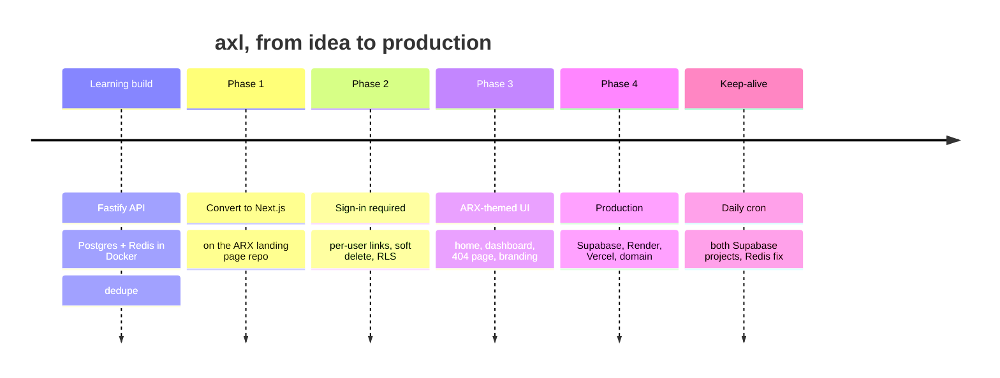

# 10. Project history

How axl was built, in order: what was done at each step, the decisions made, and the
problems hit along the way. Built from 29 September to 1 October 2026.

## Stage 0: Planning and the learning build (Fastify)

**Goal:** a URL shortener, built step by step as a system-design exercise.

**Plan agreed:**
- Node + TypeScript + Fastify, Postgres + Redis in Docker Compose.
- 7-character random base62 codes, with collisions caught by a `UNIQUE` constraint and
  retried.
- 302 redirects (not 301), so clicks can be counted and links changed or expired.
- Cache-aside in Redis; click counts buffered in Redis and batched into Postgres.

**What was built** (guided by [GUIDE.md](GUIDE.md), written by the developer step by step):
config, migrations and a migration runner, the short-code generator, URL validation, the
repository/service/routes layers, the Redis cache with negative caching and
expiry-aware TTLs, click batching, rate limiting, integration tests, and a one-file
frontend.

**Additions after the guide:**
- **Dedupe**: the same URL returns the same link. A partial unique index on a hash of
  the URL makes it race-free. Existing duplicate rows were kept (their codes might
  already be shared), with the oldest marked canonical.
- **Frontend spam guard**: repeat submits of the same URL are answered from the
  browser's memory; the button is disabled while a request is pending; `429`s show a
  friendly message.

**Problems hit:**
- A Postgres was already running on port 5432, so Docker's was mapped to **5433**.
- `curl` in Windows PowerShell 5.1 is `Invoke-WebRequest`, and PowerShell strips quotes
  from JSON arguments. Hence the `curl.exe` and escaping notes in
  [Local development](09-development.md#windows--powershell-notes).

Commit: `c185f7a`.

## Choosing the hosting

Several options were weighed before settling:

| Option | Outcome |
|---|---|
| Everything on Render | Rejected: free Postgres is **deleted after 30 days**; free web services **sleep after 15 min** (a 1-minute first click is unacceptable for a shortener) |
| App on Render, UI on Vercel | Rejected: still sleeps; redirects would need proxying between two hosts |
| **UI + API on Vercel, Postgres on Supabase, Redis on Render** | **Chosen**: no sleeping, one domain, free tiers that don't expire |

Further decisions:
- **Reuse the ARX Studios landing page's Supabase project for sign-in**, so it's the same
  accounts as arxstudios.pro. A separate project holds axl's data.
- **Region: Singapore.** The data project was first created in Tokyo, but Render has no
  Tokyo region, so it was recreated in `ap-southeast-1` to keep every redirect hop in
  one city.
- **Next.js instead of Fastify**, to reuse the landing page's theme and components
  directly, and so the UI, API and redirects are one deployment.
- **Login required**; **no shared session** with arxstudios.pro.
- The auth project's signing key is **ECC P-256** (asymmetric), so axl can verify tokens
  locally without calling Supabase.

## Phase 1: Convert to Next.js

**Done:**
- A safety commit of the Fastify version, then the landing page repo copied in as the
  base (its `.git` removed).
- The repository, service, short-code and URL-validation code carried over unchanged;
  only the HTTP layer was rewritten as route handlers.
- `@fastify/rate-limit` replaced with a ~20-line Redis limiter; the `setInterval` click
  flusher replaced with `after()` plus a Redis lock (serverless has no background
  timers).
- Connections kept on `globalThis`; environment variables parsed lazily so `next build`
  works without secrets.

**Problems hit:**
- **TypeScript 7** had been installed for the Fastify version; Next 16's build needs
  TypeScript's classic API, so the project went back to **TypeScript 5**.
- Vitest's peer dependency needed newer Node types (`@types/node@24`).
- `server-only` throws in tests: aliased to a stub in `vitest.config.mts`.
- The landing repo's `.gitignore` ignored `.env*`, which would have hidden
  `.env.example`; an exception was added.

Commit: `8623510`. Smoke-tested live afterwards: create, redirect, dedupe, rate limit and
`after()` click flushing all worked.

## Phase 2: Sign-in required

**Done:**
- Supabase helpers moved to `lib/supabase/`; `proxy.ts` refreshes sessions and skips
  short-link paths; `server/auth.ts` verifies users with `getClaims()`.
- The migrations squashed into one clean `001_init.sql`: `users`, `owner_id`, per-owner
  dedupe, soft delete (`deleted_at`), and **RLS on every table**.
- New endpoints: list (keyset pagination), details (with live click counts), delete,
  and `/api/me`.
- Sign-in lands on `/dashboard`; the landing page's `/welcome` page was removed.
- 28 tests with two fake users (ownership, isolation, pagination, no code reuse).

**Decisions:**
- **Soft delete**, so deleted codes can never be claimed by someone else.
- A new local database, `axl_dev`, instead of wiping the old one.

**Problems hit:**
- The migration script's top-level `await` broke: the landing repo's `package.json` has
  no `"type": "module"`. Renamed to `scripts/migrate.mts`.
- A running dev server kept its old database pool after `.env` changed, and hit a
  missing-column error. Fixed with a restart; noted in the development docs.
- Stopping a background dev server left its Node process holding port 3000; it had to be
  stopped by process ID.

A secret admin key for the auth project was pasted into chat during setup. It's not used
by axl and should be rotated.

Commit: `ba5619a`. Real Google sign-in was verified in the browser.

## Phase 3: The ARX-themed UI

**Done:**
- Home: the WebGL shader hero, feature cards, the cinematic footer.
- Sign-in: one shared form for the page and the modal (Google + email magic link).
- Dashboard: the shorten form (alias and expiry options, client-side repeat guard,
  `429` handling), the link list (click counts, relative times, expiry badges, copy,
  delete with confirmation, load more), and an empty state.
- A branded "Link not found" page, served as plain HTML from the redirect handler (fast,
  still a real 404), and a themed generic 404.
- The privacy policy rewritten for axl.
- Unused landing components and assets removed.

**Decisions:**
- The shader runs only on marketing pages; the dashboard uses a static glow (the shader
  runs continuously, which costs battery on a page kept open).
- Keep email magic-link sign-in; keep the cinematic footer on the home page.

**Verification:** headless screenshots at desktop and phone widths, measuring overflow
and console errors. Plain headless Chrome gave false results: it can't make a window
narrower than ~500px, and captured pages before their fade-in. `puppeteer-core` with real
device emulation was used instead. The dashboard was screenshotted through a temporary
fake-data page, since headless browsers can't sign in with Google. Fixed along the way:
tagline contrast over the shader, and phone-width wrapping in the delete confirmation and
footer.

**Branding iterations:** the home heading became the spelled-out name with **A**, **X**
and **L** highlighted, first as "ARX eXpress Links", then **"Advanced eXpress Links"**. The
cinematic footer was restored to the landing page original, with its pre-launch copy
updated ("It's here.", "Now Live", "Get Started").

Commits: `10f256b` to `d101f23`.

## Phase 4: Production

**Code first:**
- `vercel.json` pins functions to `sin1`.
- Verified TLS to Postgres with Supabase's CA certificate. `pg` lets SSL parameters in
  the URL override the explicit config, so they're stripped (confirmed in `pg`'s source).
- Redis outage fallback. Measured with Redis stopped: redirects first **hung for 20s+**
  (a stale dev-server client); with the new settings, they took 1.5–3s, then **0.2–0.5s**
  after skipping the cache write when the read had already failed.
- `migrate:prod` with verified TLS; `.env.supabase` and `certs/` git-ignored.

**Setup, one dashboard step at a time** (see
[Infrastructure & deployment](07-infrastructure-and-deployment.md)): the Supabase
migration (a wrong certificate was confirmed to be refused), Render Key Value (tested over
TLS), Vercel with Production-only env vars, the Hostinger CNAME, and the auth project's
redirect URL.

**Result:** live at **https://axl.arxstudios.pro**, with the full signed-in flow verified
by hand in production.

Commits: `30df46a`, `d94be7c`.

## Keep-alive and the Redis login bug

**Need:** free Supabase projects pause after a week without **database** activity, and
axl depends on two. Render's free Key Value turned out not to sleep at all.

**Done:**
- A daily Vercel Cron job (the Hobby plan allows once a day) that queries
  arxExpressLinks, flushes buffered clicks and pings Redis.
- A `keepalive()` heartbeat function in the auth project, called with the publishable
  key, so axl needs no credentials for that database. Checked that its table can't be
  read or written directly.

**The bug it exposed:** the first runs reported `redis: error`. Step by step:
1. `Command timed out` → added a wait for the connection plus per-step timings.
2. `Redis not ready after 5000ms (status: reconnecting)` → Redis was reachable from a
   laptop, and production redirects had written keys, so it wasn't a network block.
3. Timing each stage of a raw connection showed TCP ~65 ms and TLS ~70 ms, but **`AUTH`
   2.5–4.9 seconds**, every time, while later commands took ~70 ms.
4. ioredis sends `AUTH` as a normal command, so the client-wide 500 ms `commandTimeout`
   killed every login and reconnected forever. Fresh production instances had silently
   been serving all redirects from Postgres.

**Fix:** no `commandTimeout` on the client; callers bound their own waits
(`lib/timeout.ts`: 500 ms for cache calls, 1 s for the rate limiter); the cron waits up to
10 s. Confirmed against the real Render instance: ready after ~4.3s with no reconnects,
then ~65 ms reads from India. The next production run reported `postgres`, `authProject`
and `redis` all `ok`.

Commits: `4e62d93`, `b2e53c8`, `c390223`, `fa22565`.

## Where things stand

- Live and self-maintaining day to day.
- 40 automated tests; type check, lint and production build clean.
- Open follow-ups are listed in the [Operations runbook](08-operations-runbook.md#maintenance-checklist):
  domain auto-renew, rotating the exposed admin key, Dependabot, link-abuse protection,
  and Vercel Pro before commercial use.
