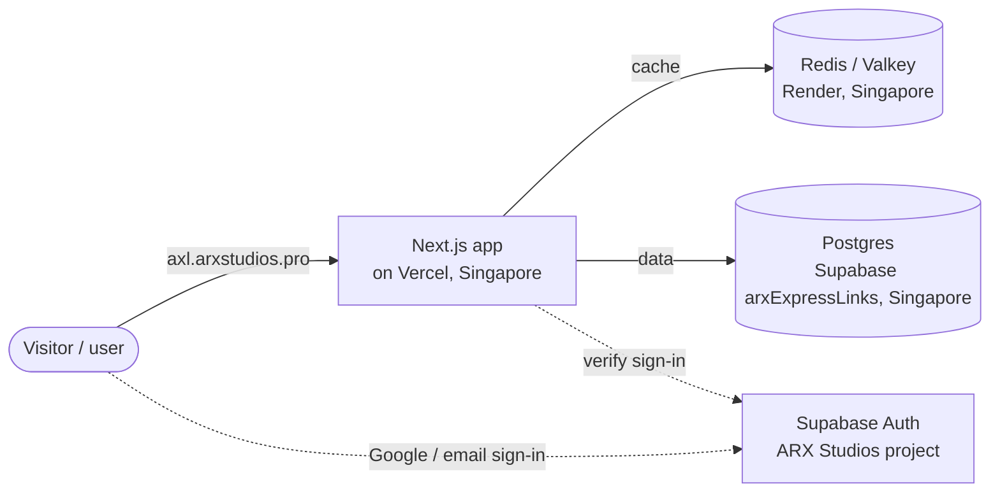

# axl documentation

**axl** (*Advanced eXpress Links*) is the URL shortener by ARX Studios, live at
**https://axl.arxstudios.pro**.

These docs describe what was built, how it fits together, why it was designed this
way, and how to run and maintain it.

| # | Document | Read this when you want to… |
|---|---|---|
| 1 | [Overview](01-overview.md) | get the big picture: features, tech stack, repo layout |
| 2 | [Architecture](02-architecture.md) | understand the components, where they run, and how the code is layered |
| 3 | [System design](03-system-design.md) | understand the design decisions and trade-offs (short codes, caching, click counting, dedupe, failure handling) |
| 4 | [Request flows](04-request-flows.md) | follow a request step by step: sign-in, create, redirect, delete, the daily cron |
| 5 | [Data model](05-data-model.md) | see the Postgres schema, indexes, RLS, and every Redis key |
| 6 | [Security](06-security.md) | review auth, access control, TLS, secrets and abuse protection |
| 7 | [Infrastructure & deployment](07-infrastructure-and-deployment.md) | set up or rebuild production, deploy changes, run migrations |
| 8 | [Operations runbook](08-operations-runbook.md) | keep it running: monitoring, incidents, maintenance checklist |
| 9 | [Local development](09-development.md) | run it on your machine, run tests, add features |
| 10 | [Project history](10-project-history.md) | see how it was built, phase by phase, with the problems hit along the way |

The older [GUIDE.md](GUIDE.md) is the step-by-step learning guide for the **original
Fastify version** (commit `c185f7a`). It no longer matches the code, but the concepts
it teaches (layering, cache-aside, click batching) still apply.

## One-minute summary

- Anyone can **open** a short link; only signed-in ARX Studios users can **create** them.
- Redirects are served from a Redis cache in front of Postgres, and keep working
  (from Postgres) if Redis is unavailable.
- Clicks are counted in Redis and written to Postgres in batches.
- A daily cron job keeps both free Supabase projects from pausing.
